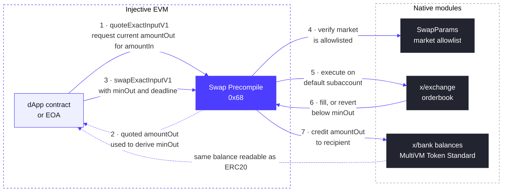

# Swap 预编译（Precompile）

Swap Precompile 是一个位于固定地址 `0x0000000000000000000000000000000000000068` 的系统智能合约，在 v1.20.4（Meridian）升级中引入。

它通过 **exchange 模块**（`x/exchange`）为 EVM 开发者提供基于 Injective 链上订单簿的原生现货兑换，其 API 与 AMM 路由器类似，使用起来会很熟悉：先报价，设置最小输出和截止时间，然后在一次调用中完成兑换。与 AMM 不同的是，兑换针对实时订单簿流动性成交，要么在你设定的约束条件内成交，要么回滚（revert）。不存在需要处理的部分成交剩余。

兑换在调用者的默认子账户上执行，失败时回滚。调用者必须持有输入数量的 `tokenIn`。由于 MultiVM Token Standard 下的 ERC20 余额即为 bank 余额，因此无需针对该 precompile 单独授权（approve）。

## 工作原理



该流程分为两个阶段：

**报价（步骤 1 和 2）。** `quoteExactInputV1` 是一个只读调用，返回给定的 `amountIn` 在当前订单簿上可获得的 `amountOut`。订单簿价格每个区块都会变化，因此调用者需根据报价推导出 `minOut`，通常是应用一个滑点容忍度。如果在没有最新报价的情况下设置 `minOut`，设置过紧可能会因正常价格波动而回滚，设置过松则可能接受比必要情况更差的成交。

**兑换（步骤 3 至 7）。** `swapExactInputV1` 在一笔交易中完成全部执行：precompile 根据 `SwapParams` 白名单检查市场，在调用者的默认子账户上下单，然后要么在 `deadline` 之前向接收方转入至少 `minOut` 的数量，要么回滚整个调用。不会留下任何部分完成的状态。输出以 bank 余额的形式到账，借助 MultiVM Token Standard，可立即作为 ERC20 余额读取。

## 市场白名单

可兑换的市场由 `SwapParams` 管理，它是 exchange 模块参数中的一个启用标志加上一个市场白名单。在未列入白名单的市场上调用该 precompile 会回滚，并返回：

```
market <id> is not allowlisted for swaps: invalid swap route
```

收到此回滚仍然可以确认你已在一个运行中的节点上成功调用到该 precompile。

### 查看当前白名单

当前生效的白名单是 exchange 模块 v2 参数的一部分：

```bash
curl -s https://sentry.lcd.injective.network/injective/exchange/v2/exchangeParams \
  | jq '.params.swap_params'
```

同一查询中的 `.params.exchange_admins` 字段列出了有权更新白名单的地址。

### 申请添加市场

如果你正在基于 swap precompile 进行开发，并需要将某个市场加入白名单，请在 [Injective Discord](https://discord.gg/injective) 的 `#developers` 频道中提供现货市场 id 进行联系，或向你的 Injective 合作伙伴联系人提出。活跃现货市场的市场 id 可通过 `/injective/exchange/v1beta1/spot/markets?status=Active` 查询。

### 更新白名单（exchange 管理员）

`MsgUpdateSwapParams` 可由治理权限账户或 `exchange_admins` 参数中的任意地址调用。它会立即生效；由管理员发送时，无需治理投票。

该消息会**完全替换** swap 参数组。请始终包含所有应保留在白名单中的市场，并保持 `enabled: true`，因为遗漏现有市场会将其移除，而遗漏该标志则会暂停所有兑换。

```json
{
  "body": {
    "messages": [
      {
        "@type": "/injective.exchange.v2.MsgUpdateSwapParams",
        "sender": "<admin inj1... address>",
        "swap_params": {
          "enabled": true,
          "allowed_markets": [
            "0x<existing market id>",
            "0x<new market id>"
          ]
        }
      }
    ]
  },
  "auth_info": {
    "fee": {
      "amount": [{ "denom": "inj", "amount": "200000000000000" }],
      "gas_limit": "400000"
    }
  }
}
```

使用管理员密钥，通过 `injectived tx sign` 和 `injectived tx broadcast` 签名并广播该交易文档。

## Swap Precompile 接口

```solidity
interface ISwapModule {
    /// Quote the output for an exact input amount. Read-only.
    function quoteExactInputV1(
        address tokenIn,
        string calldata marketId,
        uint256 amountIn
    ) external view returns (uint256 amountOut);

    /// Quote the input required for an exact output amount. Read-only.
    function quoteExactOutputV1(
        address tokenOut,
        string calldata marketId,
        uint256 amountOut
    ) external view returns (uint256 amountIn);

    /// Swap an exact input amount. Reverts if the output would fall below
    /// minOut or the deadline (unix seconds) has passed.
    function swapExactInputV1(
        address tokenIn,
        string calldata marketId,
        uint256 amountIn,
        uint256 minOut,
        address recipient,
        uint256 deadline
    ) external returns (uint256 amountOut);
}
```

参数说明：

* `tokenIn` / `tokenOut` 是在 MultiVM Token Standard 下由 bank 模块支持的 token 的 ERC20 地址。可通过 ERC20 模块查询 `/injective/erc20/v1beta1/all_token_pairs` 将 bank denom 映射为 ERC20 地址。
* `marketId` 是以 `0x` 为前缀的现货市场 id 字符串。可通过 `/injective/exchange/v1beta1/spot/markets?status=Active` 列出活跃市场。
* 数量使用 token 的 ERC20 精度（decimals）。

## 报价与兑换模式

```solidity
uint256 quoted = SWAP.quoteExactInputV1(tokenIn, marketId, amountIn);
uint256 minOut = (quoted * (10_000 - slippageBps)) / 10_000;
uint256 amountOut = SWAP.swapExactInputV1(
    tokenIn, marketId, amountIn, minOut, recipient, block.timestamp + 120
);
```

## 通过命令行调用

Precompile 仅存在于真实的 Injective 节点上。Foundry 的本地模拟中没有 `0x68`，因此 `forge script` 和 `forge test` 在任何涉及它的代码路径上都会回滚，并报错 `call to non-contract address`。这适用于所有 Injective precompile。你可以针对实时 RPC 使用 `cast`，部署合约并通过交易驱动它，或者运行 [inj-examples 中的本地开发环境](https://github.com/InjectiveLabs/inj-examples/tree/main/examples/precompiles/local-dev)，它会在 Docker 中启动一个真实的 Injective 节点，所有 precompile 均可通过 `localhost:8545` 使用：

```bash
cast call 0x0000000000000000000000000000000000000068 \
  "quoteExactInputV1(address,string,uint256)(uint256)" \
  <TOKEN_IN> "<MARKET_ID>" <AMOUNT_IN> \
  --rpc-url https://sentry.evm-rpc.injective.network/
```

## 开始构建

完整的 Foundry 示例可在 [swap precompile 演示](https://github.com/InjectiveLabs/inj-examples/tree/main/examples/swap-precompile) 中找到，其中包含一个先报价后兑换的合约、通过 `cast` 进行报价和兑换的 Makefile 目标，以及测试网默认配置。测试网自 v1.20.4-beta 起已运行该 precompile；主网自 v1.20.4 升级起运行。
