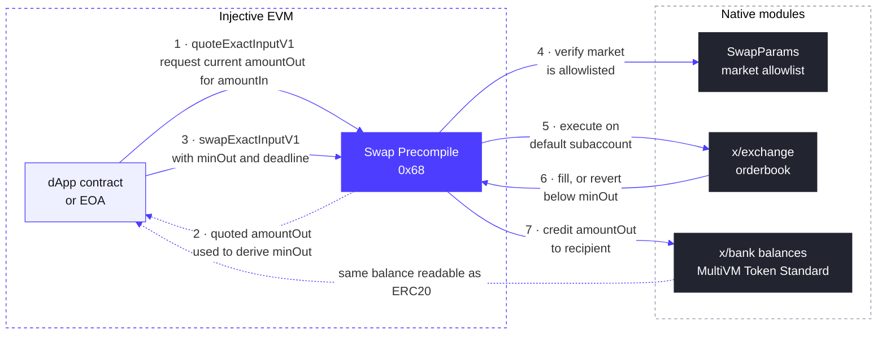

# Swap Precompile

The Swap Precompile is a system smart contract residing at the fixed address `0x0000000000000000000000000000000000000068`, introduced in the v1.20.4 (Meridian) upgrade.

It gives EVM developers native spot swaps against Injective's on-chain orderbook through the **exchange module** (`x/exchange`), using an API that will feel familiar from AMM routers: quote, set a minimum output and a deadline, swap in a single call. Unlike an AMM, execution fills against live orderbook liquidity, and the swap either fills within your constraints or reverts. There is no partially filled remainder to manage.

Swaps execute on the caller's default subaccount and revert on failure. The caller must hold the input amount of `tokenIn`. Because ERC20 balances under the MultiVM Token Standard are bank balances, no separate approval against the precompile is required.

## How It Works



The flow has two phases:

**Quote (steps 1 and 2).** `quoteExactInputV1` is a read call that returns the `amountOut` the given `amountIn` would currently receive against the orderbook. Orderbook prices change block to block, so the caller derives `minOut` from the quoted value, typically by applying a slippage tolerance. Setting `minOut` without a current quote risks either reverting on normal price movement when set too tight, or accepting a worse fill than necessary when set too loose.

**Swap (steps 3 to 7).** `swapExactInputV1` runs the whole execution in one transaction: the precompile checks the market against the `SwapParams` allowlist, places the order on the caller's default subaccount, and either credits at least `minOut` to the recipient before the `deadline` or reverts the entire call. Nothing is left partially done. The output lands as a bank balance, which the MultiVM Token Standard makes immediately readable as an ERC20 balance.

## Market Allowlist

Swappable markets are governed by `SwapParams`, an enable flag plus a market allowlist inside the exchange module parameters. Calling the precompile on a market that is not allowlisted reverts with:

```
market <id> is not allowlisted for swaps: invalid swap route
```

Receiving this revert still confirms you have reached the precompile on a live node.

### Checking the current allowlist

The live allowlist is part of the exchange module's v2 parameters:

```bash
curl -s https://sentry.lcd.injective.network/injective/exchange/v2/exchangeParams \
  | jq '.params.swap_params'
```

The same query's `.params.exchange_admins` field lists the addresses authorized to update it.

### Requesting a market

If you are building on the swap precompile and need a market allowlisted, reach out in the `#developers` channel of the [Injective Discord](https://discord.gg/injective) with the spot market id, or raise it with your Injective partner contact. Market ids for active spot markets are listed at `/injective/exchange/v1beta1/spot/markets?status=Active`.

### Updating the allowlist (exchange admins)

`MsgUpdateSwapParams` is callable by the governance authority or any address in the `exchange_admins` parameter. It takes effect immediately, with no governance vote required when sent by an admin.

The message **fully replaces** the swap parameter group. Always include every market that should remain allowlisted and keep `enabled: true`, because omitting an existing market removes it and omitting the flag pauses all swaps.

```json
{
  "body": {
    "messages": [
      {
        "@type": "/injective.exchange.v2.MsgUpdateSwapParams",
        "sender": "<admin inj1... address>",
        "swap_params": {
          "enabled": true,
          "allowed_markets": [
            "0x<existing market id>",
            "0x<new market id>"
          ]
        }
      }
    ]
  },
  "auth_info": {
    "fee": {
      "amount": [{ "denom": "inj", "amount": "200000000000000" }],
      "gas_limit": "400000"
    }
  }
}
```

Sign and broadcast the transaction document with `injectived tx sign` and `injectived tx broadcast` from the admin key.

## Swap Precompile Interface

```solidity
interface ISwapModule {
    /// Quote the output for an exact input amount. Read-only.
    function quoteExactInputV1(
        address tokenIn,
        string calldata marketId,
        uint256 amountIn
    ) external view returns (uint256 amountOut);

    /// Quote the input required for an exact output amount. Read-only.
    function quoteExactOutputV1(
        address tokenOut,
        string calldata marketId,
        uint256 amountOut
    ) external view returns (uint256 amountIn);

    /// Swap an exact input amount. Reverts if the output would fall below
    /// minOut or the deadline (unix seconds) has passed.
    function swapExactInputV1(
        address tokenIn,
        string calldata marketId,
        uint256 amountIn,
        uint256 minOut,
        address recipient,
        uint256 deadline
    ) external returns (uint256 amountOut);
}
```

Parameter notes:

* `tokenIn` / `tokenOut` are ERC20 addresses of tokens backed by the bank module under the MultiVM Token Standard. Map bank denoms to ERC20 addresses with the ERC20 module query `/injective/erc20/v1beta1/all_token_pairs`.
* `marketId` is the spot market id string, prefixed with `0x`. List active markets with `/injective/exchange/v1beta1/spot/markets?status=Active`.
* Amounts use the token's ERC20 decimals.

## Quote and Swap Pattern

```solidity
uint256 quoted = SWAP.quoteExactInputV1(tokenIn, marketId, amountIn);
uint256 minOut = (quoted * (10_000 - slippageBps)) / 10_000;
uint256 amountOut = SWAP.swapExactInputV1(
    tokenIn, marketId, amountIn, minOut, recipient, block.timestamp + 120
);
```

## Calling From the Command Line

Precompiles exist only on real Injective nodes. Foundry's local simulation has no `0x68`, so `forge script` and `forge test` revert with `call to non-contract address` on any code path touching it. This applies to all Injective precompiles. Use `cast` against a live RPC, deploy a contract and drive it with transactions, or run the [local development setup in inj-examples](https://github.com/InjectiveLabs/inj-examples/tree/main/examples/precompiles/local-dev), which starts a real Injective node in Docker with all precompiles available at `localhost:8545`:

```bash
cast call 0x0000000000000000000000000000000000000068 \
  "quoteExactInputV1(address,string,uint256)(uint256)" \
  <TOKEN_IN> "<MARKET_ID>" <AMOUNT_IN> \
  --rpc-url https://sentry.evm-rpc.injective.network/
```

## Start building

A complete Foundry example, with a quote-then-swap contract, Makefile targets for quoting and swapping via `cast`, and testnet defaults, is available in the [swap precompile demo](https://github.com/InjectiveLabs/inj-examples/tree/main/examples/swap-precompile). Testnet has run the precompile since v1.20.4-beta; mainnet since the v1.20.4 upgrade.
