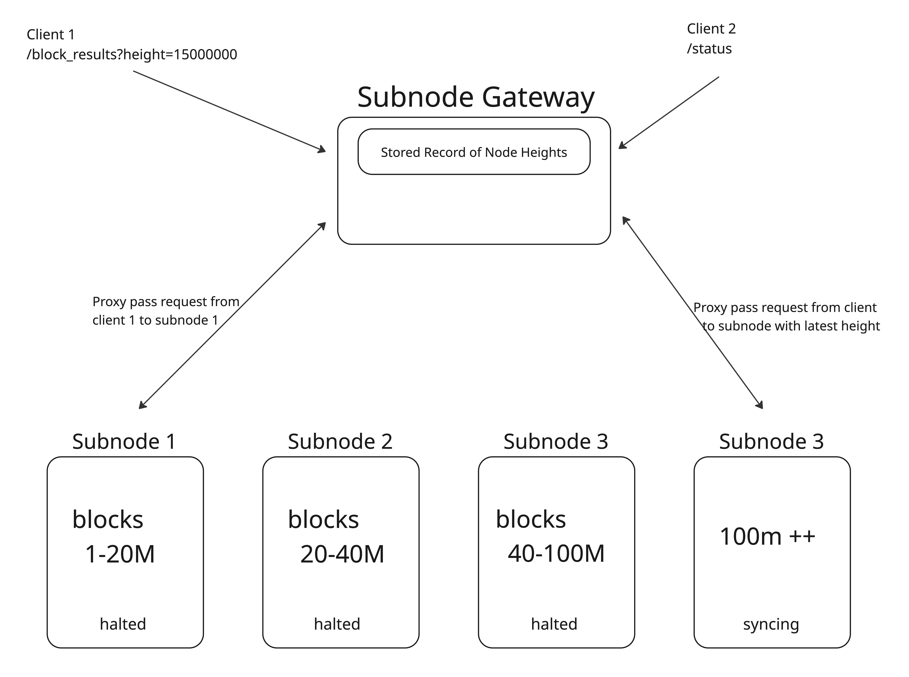

# Archival setup

This guide will walk you through the process of creating a fleet of nodes that serve archival data and how to stitch them together using a gateway

## Architecture 

To make serving archival data more accessible we split the data into smaller segments. These segments are stored in `s3://injective-snapshots/mainnet/subnode`

| Snapshot Dir | Height Range | Injective Version | Recommended Disk Size |
| ------------ | ------------ | ----------------- | --------------------- |
| `/0073`      | 0 – 73M      | v1.12.1           | 42 TiB                |
| `/6068`      | 60M – 68M    | v1.12.1           | 7 TiB                 |
| `/7380`      | 73M – 80M    | v1.12.1           | 7 TiB                 |
| `/8088`      | 80M – 88M    | v1.13.3           | 7 TiB                 |
| `/8896`      | 88M – 96M    | v1.13.3           | 7 TiB                 |
| `/8898`      | 88M – 98M    | v1.13.3           | 7 TiB                 |
| `/98106`     | 98M – 106M   | v1.13.3           | 7 TiB                 |
| `/98107`     | 98M – 107M   | v1.14.0           | 7.5 TiB               |
| `/66101`     | 66M – 101M   | v1.14.0           | 27 TiB                |
| `/105116`    | 105M – 116M  | v1.15.0           | 7.5 TiB               |


These segments are stitched together via gateway which is an aggregator proxy that routes queries to the appropriate node based on block range



## System Requirements

Each node hosting a slice of archival data should have the following minimum requirements

| Component   | Minimum Specification | Notes                                                      |
| ----------- | --------------------- | ---------------------------------------------------------- |
| **CPU**     | AMD EPYC™ 9454P       | 48 cores / 96  threads                                     |
| **Memory**  | 128 GB DDR5 ECC       | DDR5-5200 MHz or higher, ECC for data integrity            |
| **Storage** | 7 – 40 TB NVMe Gen 4  | PCIe 4.0 drives, can be single drives or in a RAID-0 array |

## Setup Steps
### On each node hosting an archival segment:
#### 1. Download the archival segments with the history your setup requires using 
```bash
aws s3 cp --recursive s3://injective-snapshots/mainnet/subnode/<SNAPSHOT_DIR> $INJ_HOME
```

#### 2. Download or set the appropriate injective binary or image tag based on the table above

#### 3. Generate your config folder 
```bash
injectived init $MONIKER --chain-id injective-1 --home $INJ_HOME --overwrite
```
#### 4. Disable pruning in your app.toml file and block p2p and set the log level to error in your config.toml files.

This ensures that the data does not get pruned and the node stays in a halted state. Setting the log level to error lessens disk ops and improves performance.

```bash
# Disable pruning in app.toml
sed -i 's/^pruning *= *.*/pruning = "nothing"/' $INJ_HOME/config/app.toml

# Disable p2p and disable create empty blocks on config.toml
awk '
    BEGIN { section = "" }
    /^\[/ {
    section = $0
    }
    section == "[p2p]" {
    if ($1 ~ /^laddr/) $0 = "laddr = \"tcp://0.0.0.0:26656\""
    if ($1 ~ /^max_num_inbound_peers/) $0 = "max_num_inbound_peers = 0"
    if ($1 ~ /^min_num_inbound_peers/) $0 = "min_num_inbound_peers = 0"
    if ($1 ~ /^pex/) $0 = "pex = false"
    if ($1 ~ /^seed_mode/) $0 = "seed_mode = false"
    }
    section == "[consensus]" {
    if ($1 ~ /^create_empty_blocks/) $0 = "create_empty_blocks = false"
    }
    { print }
    ' $INJ_HOME/config/config.toml > $INJ_HOME/config/config.tmp && mv $INJ_HOME/config/config.tmp $INJ_HOME/config/config.toml

# Set log level to error (less disk writes = better performance)
sed -i 's/^log_level *= *.*/log_level = "error"/' $INJ_HOME/config/app.toml
```

#### 5. Run your node 
```bash
injectived start --home $INJ_HOME
```

### Gateway configuration

#### 1. Clone the gateway repository
```bash
git clone https://github.com/decentrio/gateway
```
#### 2. Build gateway 
```bash
make build
```
#### 3. Create your config file
```yaml
upstream:
  # example node 1 holds blocks 0-80M while node 2 holds blocks 80-88M
  - rpc: "http://$NODE1:$RPC_PORT"
    grpc: "$NODE1:$GRPC_PORT"
    api: "http://$NODE1:$API_PORT"
    blocks: [0,80000000]  
  - rpc: "http://$NODE2:$RPC_PORT"
    grpc: "$NODE2:$GRPC_PORT"
    api: "http://$NODE2:$API_PORT"
    blocks: [80000000,88000000]

  # <OTHER NODES HERE>

  # Archival tip, this serves the latest x blocks, usually set as a pruned node
  - rpc: "http://$PRUNED_NODE:$RPC_PORT"
    grpc: "$PRUNED_NODE:$GRPC_PORT"
    api: "http://$PRUNED_NODE:$API_PORT"
    blocks: [1000]


ports:
  rpc: $RPC_PORT
  api: $API_PORT 
  grpc: $GRPC_PORT
  # Leave these as zero to disable for now
  jsonrpc: 0
  jsonrpc_ws: 0

```
#### 4. Run Gateway
```bash
gateway start --config $CONFIG_FILE
```
