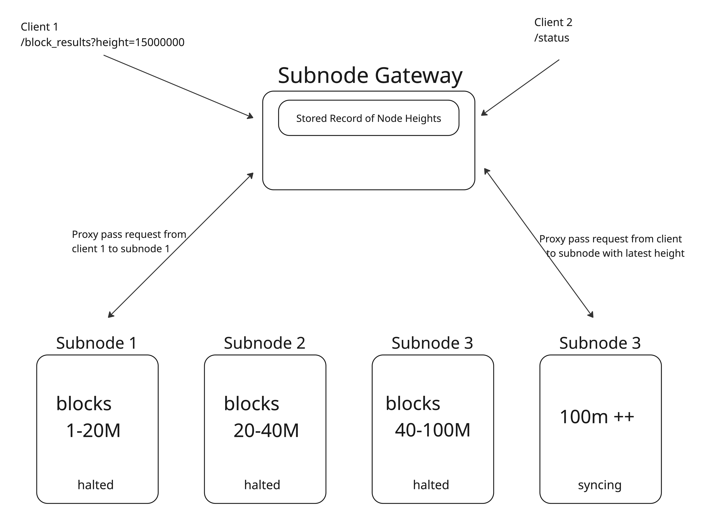

Setup, configuration, and recovery guide for Injective archival nodes. Covers deploying a segmented archival fleet behind a gateway proxy, as well as restoring archival nodes after coordinated upgrades or unscheduled halts.

<Callout icon="info" color="#22C55E" iconType="regular">
**Looking for pruned snapshots or validator recovery?** See the [Validator Troubleshooting Guide](/infra/coordinated-upgrades) for pruned snapshot resources and coordinated security upgrade recovery procedures.
</Callout>

<Callout icon="warning" color="#FF8C00" iconType="regular">
**Restoring after an upgrade or halt?** Skip to [Restoring Archival Nodes After an Upgrade or Halt](#restoring-archival-nodes-after-an-upgrade-or-halt) for recovery procedures.
</Callout>

## Archival Setup

To make serving archival data more accessible we split the data into smaller segments. These segments are stored in `s3://injective-snapshots/mainnet/subnode`

The bucket is publicly accessible. No AWS credentials are required:

```bash
# List all available segments using AWS CLI
aws s3 ls --no-sign-request s3://injective-snapshots/mainnet/subnode/

# Or without AWS CLI, using curl
curl -s "https://injective-snapshots.s3.amazonaws.com/?prefix=mainnet/subnode/&delimiter=/" \
  | tr '<' '\n' | sed -n 's/^Prefix>mainnet\/subnode\/\([^/]*\)\/.*/\1/p' | sort -n
```

#### Naming convention

Directory names encode the block height range in millions. For example, `138150` contains blocks from 138M to 150M. Where segments overlap (e.g., `8896` vs `8898`, or `119127` vs `119141` vs `119143`), the newer or wider segment typically includes corrections or extends coverage. Pick the segment that best covers your target range without unnecessary overlap.

#### Available segments

<Note>
This table may not include the latest segments. Run the `aws s3 ls` command above to check for newly published segments.
</Note>

| Snapshot Dir | Height Range | Injective Version | Recommended Disk Size |
| ------------ | ------------ | ----------------- | --------------------- |
| `0073`       | 0 – 73M      | v1.12.1           | 42 TiB                |
| `6068`       | 60M – 68M    | v1.12.1           | 7 TiB                 |
| `7380`       | 73M – 80M    | v1.12.1           | 7 TiB                 |
| `8088`       | 80M – 88M    | v1.13.3           | 7 TiB                 |
| `8896`       | 88M – 96M    | v1.13.3           | 7 TiB                 |
| `8898`       | 88M – 98M    | v1.13.3           | 7 TiB                 |
| `98106`      | 98M – 106M   | v1.13.3           | 7 TiB                 |
| `98107`      | 98M – 107M   | v1.14.0           | 7.5 TiB               |
| `66101`      | 66M – 101M   | v1.14.0           | 27 TiB                |
| `105116`     | 105M – 116M  | v1.15.0           | 7.5 TiB               |
| `113127`     | 113M – 127M  | v1.15.0           | 11 TiB                |
| `119127`     | 119M – 127M  | TBD               | TBD                   |
| `119141`     | 119M – 141M  | TBD               | TBD                   |
| `119143`     | 119M – 143M  | v1.17.0           | 16 TiB                |
| `138150`     | 138M – 150M  | v1.17.2           | 5.8 TiB               |
| `150181`     | 150M – 181M  | Coming soon        | Coming soon           |

<Warning>
Rows marked **TBD** or **Coming soon** are segments that exist in S3 but have not yet been verified for version and disk size. Contact the infra team or check the segment metadata before using these.
</Warning>

#### Choosing segments for full coverage

Several segments overlap in height range. You do not need all of them. Here is a recommended minimal set for full archival coverage from genesis to the current chain tip:

| Node | Segment | Height Range | Notes |
| ---- | ------- | ------------ | ----- |
| 1    | `0073`  | 0 – 73M      | Genesis through early chain history |
| 2    | `7380`  | 73M – 80M    | |
| 3    | `8088`  | 80M – 88M    | |
| 4    | `8898`  | 88M – 98M    | Use `8898` over `8896` for wider coverage |
| 5    | `98107` | 98M – 107M   | Use `98107` over `98106` for wider coverage and newer binary |
| 6    | `105116`| 105M – 116M  | Overlaps with previous, provides redundancy |
| 7    | `119143`| 119M – 143M  | Use widest segment to minimize node count |
| 8    | `138150`| 138M – 150M  | |
| 9    | `150181`| 150M – 181M  | Latest segment, covers up to recent chain height |
| Tip  | pruned  | latest blocks | A pruned node covers the gap between the newest segment and the live chain tip |

The **pruned tip node** is essential. Archival segments are static snapshots that do not sync with the live chain. The gateway routes queries for recent blocks to the pruned node, which stays synced via p2p. See the [gateway config](#gateway-configuration) below for how to configure the tip node with `blocks: [1000]`.

These segments are stitched together via gateway which is an aggregator proxy that routes queries to the appropriate node based on block range



## System Requirements

Each node hosting a slice of archival data should have the following minimum requirements

| Component   | Minimum Specification | Notes                                                      |
| ----------- | --------------------- | ---------------------------------------------------------- |
| **CPU**     | AMD EPYC™ 9454P       | 48 cores / 96  threads                                     |
| **Memory**  | 128 GB DDR5 ECC       | DDR5-5200 MHz or higher, ECC for data integrity            |
| **Storage** | 7 – 40 TB NVMe Gen 4  | PCIe 4.0 drives, can be single drives or in a RAID-0 array |

## Setup Steps
### On each node hosting an archival segment:
#### 1. Download the archival segments with the history your setup requires using 
```bash
# SNAPSHOT_DIR matches the "Snapshot Dir" column in the table above (0073, 138150)
aws s3 cp --no-sign-request --recursive s3://injective-snapshots/mainnet/subnode/$SNAPSHOT_DIR $INJ_HOME
```

#### 2. Download or set the appropriate injective binary or image tag based on the table above

#### 3. Generate your config folder 
```bash
injectived init $MONIKER --chain-id injective-1 --home $INJ_HOME --overwrite
```
#### 4. Disable pruning in your app.toml file and block p2p and set the log level to error in your config.toml files.

This ensures that the data does not get pruned and the node stays in a halted state. Setting the log level to error lessens disk ops and improves performance.

```bash
# Disable pruning in app.toml
sed -i 's/^pruning *= *.*/pruning = "nothing"/' $INJ_HOME/config/app.toml

# Disable p2p and disable create empty blocks on config.toml
awk '
    BEGIN { section = "" }
    /^\[/ {
    section = $0
    }
    section == "[p2p]" {
    if ($1 ~ /^laddr/) $0 = "laddr = \"tcp://0.0.0.0:26656\""
    if ($1 ~ /^max_num_inbound_peers/) $0 = "max_num_inbound_peers = 0"
    if ($1 ~ /^min_num_inbound_peers/) $0 = "min_num_inbound_peers = 0"
    if ($1 ~ /^pex/) $0 = "pex = false"
    if ($1 ~ /^seed_mode/) $0 = "seed_mode = false"
    }
    section == "[consensus]" {
    if ($1 ~ /^create_empty_blocks/) $0 = "create_empty_blocks = false"
    }
    { print }
    ' $INJ_HOME/config/config.toml > $INJ_HOME/config/config.tmp && mv $INJ_HOME/config/config.tmp $INJ_HOME/config/config.toml

# Set log level to error (less disk writes = better performance)
sed -i 's/^log_level *= *.*/log_level = "error"/' $INJ_HOME/config/app.toml
```

#### 5. Run your node 
```bash
injectived start --home $INJ_HOME
```

### Gateway configuration

Gateway is a reverse proxy that routes RPC, gRPC, and API queries to the correct archival node based on the requested block height. The reference implementation below is from [Decentrio](https://github.com/decentrio/gateway), an ecosystem contributor.

<Note>
Gateway it inspects incoming requests, determines the block height, and forwards to the upstream node that holds that range. Any height aware reverse proxy (nginx, Caddy, HAProxy with custom routing) can serve the same purpose.
</Note>

#### 1. Clone the gateway repository
```bash
git clone https://github.com/decentrio/gateway
```
#### 2. Build gateway 
```bash
make build
```
#### 3. Create your config file
```yaml
upstream:
  # example node 1 holds blocks 0-80M while node 2 holds blocks 80-88M
  - rpc: "http://$NODE1:$RPC_PORT"
    grpc: "$NODE1:$GRPC_PORT"
    api: "http://$NODE1:$API_PORT"
    blocks: [0,80000000]  
  - rpc: "http://$NODE2:$RPC_PORT"
    grpc: "$NODE2:$GRPC_PORT"
    api: "http://$NODE2:$API_PORT"
    blocks: [80000000,88000000]

  # <OTHER NODES HERE>

  # Archival tip, this serves the latest x blocks, usually set as a pruned node
  - rpc: "http://$PRUNED_NODE:$RPC_PORT"
    grpc: "$PRUNED_NODE:$GRPC_PORT"
    api: "http://$PRUNED_NODE:$API_PORT"
    blocks: [1000]


ports:
  rpc: $RPC_PORT
  api: $API_PORT 
  grpc: $GRPC_PORT
  # Leave these as zero to disable for now
  jsonrpc: 0
  jsonrpc_ws: 0

```
#### 4. Run Gateway
```bash
gateway start --config $CONFIG_FILE
```

---

## Restoring Archival Nodes After an Upgrade or Halt

Archival segment nodes are static so they do not participate in consensus or sync via p2p. However, they can still be affected by coordinated upgrades or unscheduled chain halts, particularly the **pruned tip node** and any segment nodes that cover recent block heights.

### Pruned tip node

The pruned tip node is the only node in the archival fleet that actively syncs with the live chain. During a coordinated upgrade or unscheduled halt, treat it the same as any other full node:

1. Stop the node
2. Swap to the new binary
3. Verify: `injectived version`
4. Start the node

The tip node does not have `priv_validator_state.json` (it is not a validator), so there is no double-signing risk. If the tip node's state is corrupted (AppHash mismatch), restore it from a pruned snapshot. See [Validator Troubleshooting & Snapshot Resources](/infra/coordinated-upgrades#snapshot-resources).

### Segment nodes covering recent heights

If an upgrade changes how historical blocks are processed or stored (a state migration that affects query results), segment nodes covering heights near the upgrade boundary may return inconsistent data. In this case:

1. Stop the affected segment node
2. Download the updated segment from S3 (the infra team may publish a corrected segment after the upgrade):
   ```bash
   aws s3 cp --no-sign-request --recursive s3://injective-snapshots/mainnet/subnode/$SNAPSHOT_DIR $INJ_HOME
   ```
3. Update the binary to the version specified for that segment
4. Restart the node

### Older segment nodes

Segment nodes covering historical block ranges (`0073`, `8088`) are generally unaffected by chain upgrades. They serve pre-existing data with the binary version that produced it. No action is needed unless the upgrade explicitly changes how historical queries are handled.

### Gateway

The gateway itself is stateless and does not need to be upgraded during a chain upgrade. However, if you add or replace segment nodes, update the gateway config to reflect the new upstream endpoints and restart it.

<Warning>
After any restoration, verify that the gateway is routing correctly by querying a block from each segment range and confirming the response. A misconfigured gateway can silently serve errors or stale data for specific height ranges.
</Warning>
