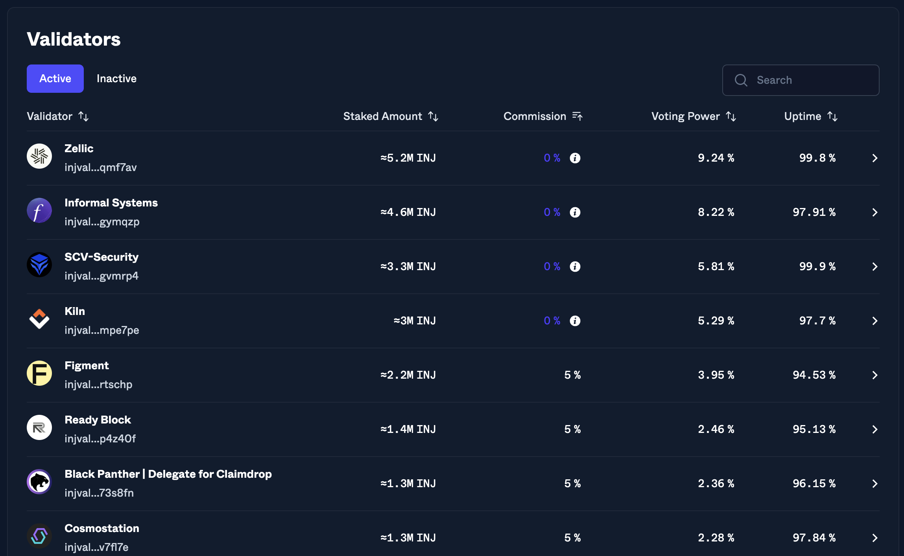

# Testnet

Node operators should deploy bare metal servers to achieve optimal performance. Additionally, validator nodes must meet the recommended hardware specifications and particularly the CPU requirements, to ensure high uptime.

#### Hardware Requirements

|           _Minimum_              |        _Recommendation_        |
| :--------------------------:     | :---------------------------:  |
|          RAM Memory 128GB        |          RAM Memory 128GB      |
|          CPU 12 cores            |          CPU 16 cores          |
|          CPU base clock 3.7GHz   |          CPU base clock 4.2GHz |
|          Storage 2TB NVMe        |          Storage 2TB NVMe      |
|          Network 1Gbps+          |          Network 1Gbps+        |

### Step 1: Create a Validator Account

First, run the keygen command with your desired validator key name.

```bash
export VALIDATOR_KEY_NAME=[my-validator-key]
injectived keys add $VALIDATOR_KEY_NAME
```

This will derive a new private key and encrypt it to disk. Make sure to remember the password you used.

```bash
# EXAMPLE OUTPUT
- name: myvalidatorkey
  type: local
  address: inj1queq795wx8gzqc8706uz80whp07mcgg5nmpj6h
  pubkey: injpub1r0mckeepqwzmrzt5af00hgc7fhve05rr0q3q6wvx4xn6k46zguzykdszg6cnu0zca4q
  mnemonic: ""
  threshold: 0
  pubkeys: []


**Important** write this mnemonic phrase in a safe place.
It is the only way to recover your account if you ever forget your password.
```


**The output will contain a mnemonic phrase that represents your key in plain text. Make sure to save this phrase as a backup of your key, since without a key you will not be able to control your validator. The phrase is better be backed up on physical paper, storing it in cloud storage may compromise your validator later.**

Remember the address starting from `inj`, this is going to be your Injective Chain Validator Account address.


### Step 2: Obtain INJ

In order to proceed with the next step, you will have to obtain some INJ on Injective.

You can request funds from the [Testnet Faucet](https://faucet.injective.network/).

After a few minutes, you should be able to verify that your deposit was successful on the UI. Alternatively, you can query your account balance using the `injectived` CLI with the following command:

```bash
injectived q bank balances <my-validator-inj-address>
```

### Step 3: Create your validator account

Obtain your node's Tendermint validator Bech32 encoded PubKey consensus address.

```bash
VALIDATOR_PUBKEY=$(injectived tendermint show-validator)
echo $VALIDATOR_PUBKEY

# Example: {"@type": "/cosmos.crypto.ed25519.PubKey", "key": "GWEJv/KSFhUUcKBWuf9TTT3Ful+3xV/1lFhchyW1TZ8="}
```

Then create your new validator initialized with a self-delegation with your INJ tokens. Most critically, you will need to decide on the values of your validator's staking parameters.

* `--moniker` - Your validator's name
* `--amount` - Your validator's initial amount of INJ to bond
* `--commission-max-change-rate` - Your validator's maximum commission change rate percentage (per day)
* `--commission-max-rate` - Your validator's maximum commission rate percentage
* `--commission-rate` - Your validator's initial commission rate percentage
* `--min-self-delegation` - Your validator's minimum required self delegation

Once you decide on your desired values, set them as follows.

```bash
MONIKER=<my-moniker>
AMOUNT=100000000000000000000inj # to delegate 100 INJ, as INJ is represented with 18 decimals.
COMMISSION_MAX_CHANGE_RATE=0.1 # e.g. for a 10% maximum change rate percentage per day
COMMISSION_MAX_RATE=0.1 # e.g. for a 10% maximum commission rate percentage
COMMISSION_RATE=0.1 # e.g. for a 10% initial commission rate percentage
MIN_SELF_DELEGATION_AMOUNT=50000000000000000000 # e.g. for a minimum 50 INJ self delegation required on the validator
```

Then run the following command to create your validator.

```bash
injectived tx staking create-validator \
--moniker=$MONIKER \
--amount=$AMOUNT \
--gas-prices=500000000inj \
--pubkey=$VALIDATOR_PUBKEY \
--from=$VALIDATOR_KEY_NAME \
--keyring-backend=file \
--yes \
--node=tcp://localhost:26657 \
--chain-id=injective-888
--commission-max-change-rate=$COMMISSION_MAX_CHANGE_RATE \
--commission-max-rate=$COMMISSION_MAX_RATE \
--commission-rate=$COMMISSION_RATE \
--min-self-delegation=$MIN_SELF_DELEGATION_AMOUNT
```

Extra `create-validator` options to consider:

```
--identity=        		The optional identity signature (ex. UPort or Keybase)
--pubkey=          		The Bech32 encoded PubKey of the validator
--security-contact=		The validator's (optional) security contact email
--website=         		The validator's (optional) website
```

You can check that your validator was successfully created by checking the
[staking dashboard](https://injhub.com/stake/),
and scrolling down to the "Validators" section.
It looks like this:


Alternatively, enter the following CLI command:

```bash
injectived q staking validators
```

If you see your validator in the list of validators, then congratulations, you have officially joined as an Equinox Staking validator! 🎉

### Step 4: (Optional) Delegate Additional INJ to your Validator

To gain a deeper empirical understanding of the user experience that your future delegators will experience, you can complete the remaining steps in the [Staking Guide](https://medium.com/injective-labs/injective-hub-guide-9a14f09f6a7d).

These steps will allow you to experience the delegation flow using MetaMask Transactions. 🦊

Alternatively, you can always use the Injective CLI to send a delegation transaction.

```bash
injectived tx staking delegate [validator-addr] [amount] --from $VALIDATOR_KEY_NAME --chain-id=injective-888 --keyring-backend=file --yes --node=tcp://localhost:26657
```

### Next Steps

Next, proceed to set up your Ethereum Bridge Relayer. This is a necessary step in order to prevent your validator from being slashed. You should do this immediately after setting up your validator.
