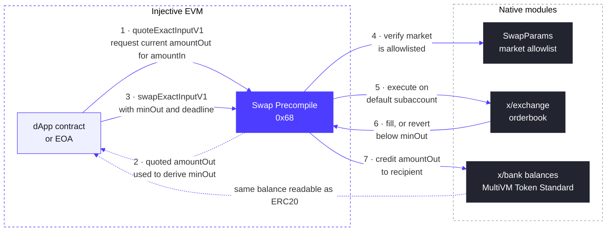

# Swap Precompile

Swap Precompileは、固定アドレス`0x0000000000000000000000000000000000000068`に存在するシステムスマートコントラクトで、v1.20.4（Meridian）アップグレードで導入されました。

EVM開発者に、**exchangeモジュール**（`x/exchange`）を通じてInjectiveのオンチェーンオーダーブックに対するネイティブなスポットスワップを提供します。APIはAMMルーターでおなじみの形式で、見積もりを取得し、最小出力量と期限を設定して、1回の呼び出しでスワップできます。AMMとは異なり、約定はライブのオーダーブック流動性に対して行われ、スワップは指定した制約内で約定するか、revertするかのいずれかです。管理が必要な部分約定の残りは発生しません。

スワップは呼び出し元のデフォルトサブアカウントで実行され、失敗した場合はrevertします。呼び出し元は`tokenIn`の入力量を保有している必要があります。MultiVM Token Standardの下ではERC20残高はbank残高であるため、precompileに対する個別のapproveは不要です。

## 仕組み



このフローは2つのフェーズで構成されます：

**見積もり（ステップ1と2）。** `quoteExactInputV1`は読み取り専用の呼び出しで、指定した`amountIn`が現在のオーダーブックに対して受け取れる`amountOut`を返します。オーダーブックの価格はブロックごとに変化するため、呼び出し元は通常、見積もり値にスリッページ許容範囲を適用して`minOut`を導出します。最新の見積もりなしに`minOut`を設定すると、厳しすぎる場合は通常の価格変動でrevertし、緩すぎる場合は必要以上に不利な約定を受け入れるリスクがあります。

**スワップ（ステップ3〜7）。** `swapExactInputV1`は実行全体を1つのトランザクションで行います。precompileはマーケットを`SwapParams`の許可リストと照合し、呼び出し元のデフォルトサブアカウントで注文を発注し、`deadline`までに少なくとも`minOut`を受取人に入金するか、呼び出し全体をrevertします。中途半端な状態で残るものはありません。出力はbank残高として反映され、MultiVM Token Standardによって即座にERC20残高として読み取れます。

## マーケット許可リスト

スワップ可能なマーケットは、exchangeモジュールのパラメータ内にある有効化フラグとマーケット許可リストで構成される`SwapParams`によって管理されます。許可リストに含まれていないマーケットに対してprecompileを呼び出すと、次のエラーでrevertします：

```
market <id> is not allowlisted for swaps: invalid swap route
```

このrevertを受け取った場合でも、稼働中のノード上でprecompileに到達できていることは確認できます。

### 現在の許可リストの確認

現在の許可リストは、exchangeモジュールのv2パラメータの一部です：

```bash
curl -s https://sentry.lcd.injective.network/injective/exchange/v2/exchangeParams \
  | jq '.params.swap_params'
```

同じクエリの`.params.exchange_admins`フィールドには、許可リストの更新が認可されたアドレスが一覧表示されます。

### マーケットのリクエスト

swap precompileを使って開発しており、マーケットを許可リストに追加する必要がある場合は、スポットマーケットIDを添えて[Injective Discord](https://discord.gg/injective)の`#developers`チャンネルで連絡するか、Injectiveのパートナー担当者に相談してください。アクティブなスポットマーケットのマーケットIDは`/injective/exchange/v1beta1/spot/markets?status=Active`で確認できます。

### 許可リストの更新（exchange admins）

`MsgUpdateSwapParams`は、ガバナンス権限者または`exchange_admins`パラメータに含まれる任意のアドレスが呼び出せます。即座に有効となり、adminが送信した場合はガバナンス投票は不要です。

このメッセージはswapパラメータグループを**完全に置き換えます**。既存のマーケットを省略すると削除され、フラグを省略するとすべてのスワップが一時停止されるため、許可リストに残すべきすべてのマーケットを必ず含め、`enabled: true`を維持してください。

```json
{
  "body": {
    "messages": [
      {
        "@type": "/injective.exchange.v2.MsgUpdateSwapParams",
        "sender": "<admin inj1... address>",
        "swap_params": {
          "enabled": true,
          "allowed_markets": [
            "0x<existing market id>",
            "0x<new market id>"
          ]
        }
      }
    ]
  },
  "auth_info": {
    "fee": {
      "amount": [{ "denom": "inj", "amount": "200000000000000" }],
      "gas_limit": "400000"
    }
  }
}
```

adminキーから`injectived tx sign`と`injectived tx broadcast`を使用して、トランザクションドキュメントに署名しブロードキャストしてください。

## Swap Precompileインターフェース

```solidity
interface ISwapModule {
    /// Quote the output for an exact input amount. Read-only.
    function quoteExactInputV1(
        address tokenIn,
        string calldata marketId,
        uint256 amountIn
    ) external view returns (uint256 amountOut);

    /// Quote the input required for an exact output amount. Read-only.
    function quoteExactOutputV1(
        address tokenOut,
        string calldata marketId,
        uint256 amountOut
    ) external view returns (uint256 amountIn);

    /// Swap an exact input amount. Reverts if the output would fall below
    /// minOut or the deadline (unix seconds) has passed.
    function swapExactInputV1(
        address tokenIn,
        string calldata marketId,
        uint256 amountIn,
        uint256 minOut,
        address recipient,
        uint256 deadline
    ) external returns (uint256 amountOut);
}
```

パラメータに関する注意：

* `tokenIn` / `tokenOut`は、MultiVM Token Standardの下でbankモジュールに裏付けられたトークンのERC20アドレスです。bank denomとERC20アドレスの対応は、ERC20モジュールのクエリ`/injective/erc20/v1beta1/all_token_pairs`で確認できます。
* `marketId`は、`0x`で始まるスポットマーケットIDの文字列です。アクティブなマーケットは`/injective/exchange/v1beta1/spot/markets?status=Active`で一覧表示できます。
* 数量はトークンのERC20 decimalsを使用します。

## 見積もりとスワップのパターン

```solidity
uint256 quoted = SWAP.quoteExactInputV1(tokenIn, marketId, amountIn);
uint256 minOut = (quoted * (10_000 - slippageBps)) / 10_000;
uint256 amountOut = SWAP.swapExactInputV1(
    tokenIn, marketId, amountIn, minOut, recipient, block.timestamp + 120
);
```

## コマンドラインからの呼び出し

Precompileは実際のInjectiveノード上にのみ存在します。Foundryのローカルシミュレーションには`0x68`が存在しないため、`forge script`や`forge test`は、これに触れるコードパスで`call to non-contract address`としてrevertします。これはすべてのInjective precompileに当てはまります。稼働中のRPCに対して`cast`を使用するか、コントラクトをデプロイしてトランザクションで操作するか、[inj-examplesのローカル開発環境](https://github.com/InjectiveLabs/inj-examples/tree/main/examples/precompiles/local-dev)を実行してください。これはDocker上で実際のInjectiveノードを起動し、すべてのprecompileを`localhost:8545`で利用可能にします：

```bash
cast call 0x0000000000000000000000000000000000000068 \
  "quoteExactInputV1(address,string,uint256)(uint256)" \
  <TOKEN_IN> "<MARKET_ID>" <AMOUNT_IN> \
  --rpc-url https://sentry.evm-rpc.injective.network/
```

## 開発を始める

見積もり後にスワップするコントラクト、`cast`による見積もりとスワップ用のMakefileターゲット、テストネットのデフォルト設定を含む完全なFoundryの例が、[swap precompileデモ](https://github.com/InjectiveLabs/inj-examples/tree/main/examples/swap-precompile)で利用可能です。テストネットではv1.20.4-betaから、メインネットではv1.20.4アップグレード以降、このprecompileが稼働しています。
