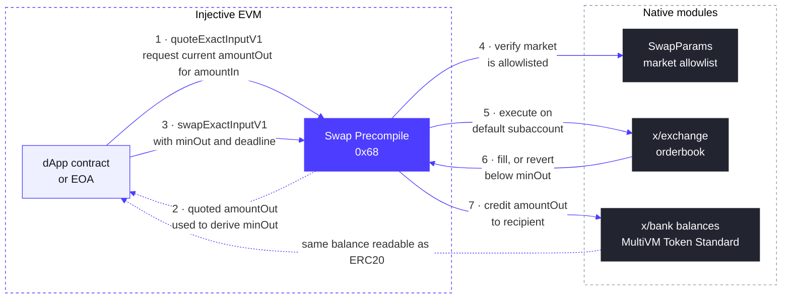

# Swap Precompile

Swap Precompile은 고정 주소 `0x0000000000000000000000000000000000000068`에 있는 시스템 스마트 컨트랙트로, v1.20.4(Meridian) 업그레이드에서 도입되었습니다.

EVM 개발자는 이를 통해 **exchange 모듈**(`x/exchange`)을 거쳐 Injective의 온체인 오더북에서 네이티브 현물 스왑을 수행할 수 있습니다. API는 AMM 라우터에서 익숙한 방식을 따릅니다. 견적을 받고, 최소 출력량과 기한을 설정한 뒤, 단일 호출로 스왑합니다. AMM과 달리 체결은 실시간 오더북 유동성을 대상으로 이루어지며, 스왑은 지정한 제약 조건 내에서 체결되거나 revert됩니다. 따로 관리해야 할 부분 체결 잔량은 없습니다.

스왑은 호출자의 기본 서브계정에서 실행되며 실패 시 revert됩니다. 호출자는 `tokenIn`의 입력 수량을 보유하고 있어야 합니다. MultiVM Token Standard에서 ERC20 잔액은 곧 bank 잔액이므로 precompile에 대한 별도의 승인(approval)은 필요하지 않습니다.

## 작동 방식



이 흐름은 두 단계로 구성됩니다:

**견적(1단계 및 2단계).** `quoteExactInputV1`은 주어진 `amountIn`으로 현재 오더북에서 받을 수 있는 `amountOut`을 반환하는 읽기 호출입니다. 오더북 가격은 블록마다 바뀌므로, 호출자는 견적 값에서 `minOut`을 도출하며 일반적으로 슬리피지 허용 범위를 적용합니다. 최신 견적 없이 `minOut`을 설정하면, 너무 빡빡하게 설정했을 때는 일반적인 가격 변동에도 revert될 수 있고, 너무 느슨하게 설정했을 때는 필요 이상으로 불리한 체결을 받아들이게 될 위험이 있습니다.

**스왑(3단계부터 7단계).** `swapExactInputV1`은 전체 실행을 하나의 트랜잭션에서 처리합니다. precompile은 `SwapParams` 허용 목록에서 마켓을 확인하고, 호출자의 기본 서브계정에 주문을 배치한 뒤, `deadline` 이전에 수신자에게 최소 `minOut`을 입금하거나 전체 호출을 revert합니다. 부분적으로 완료된 상태로 남는 것은 없습니다. 출력은 bank 잔액으로 입금되며, MultiVM Token Standard 덕분에 즉시 ERC20 잔액으로 읽을 수 있습니다.

## 마켓 허용 목록

스왑 가능한 마켓은 exchange 모듈 파라미터 내의 활성화 플래그와 마켓 허용 목록으로 구성된 `SwapParams`에 의해 관리됩니다. 허용 목록에 없는 마켓에 대해 precompile을 호출하면 다음과 같이 revert됩니다:

```
market <id> is not allowlisted for swaps: invalid swap route
```

이 revert를 받았다면 라이브 노드에서 precompile에 정상적으로 도달했다는 뜻이기도 합니다.

### 현재 허용 목록 확인

라이브 허용 목록은 exchange 모듈의 v2 파라미터에 포함되어 있습니다:

```bash
curl -s https://sentry.lcd.injective.network/injective/exchange/v2/exchangeParams \
  | jq '.params.swap_params'
```

같은 쿼리의 `.params.exchange_admins` 필드에는 이를 업데이트할 권한이 있는 주소가 나열되어 있습니다.

### 마켓 요청

Swap precompile을 기반으로 개발 중이며 마켓을 허용 목록에 추가해야 한다면, 현물 마켓 id와 함께 [Injective Discord](https://discord.gg/injective)의 `#developers` 채널에 문의하거나 Injective 파트너 담당자에게 요청하세요. 활성 현물 마켓의 마켓 id는 `/injective/exchange/v1beta1/spot/markets?status=Active`에서 확인할 수 있습니다.

### 허용 목록 업데이트(exchange 관리자)

`MsgUpdateSwapParams`는 거버넌스 권한자 또는 `exchange_admins` 파라미터에 포함된 모든 주소가 호출할 수 있습니다. 관리자가 전송하는 경우 거버넌스 투표 없이 즉시 적용됩니다.

이 메시지는 스왑 파라미터 그룹을 **완전히 대체**합니다. 허용 목록에 유지되어야 하는 모든 마켓을 항상 포함하고 `enabled: true`를 유지하세요. 기존 마켓을 누락하면 해당 마켓이 제거되고, 플래그를 누락하면 모든 스왑이 일시 중지됩니다.

```json
{
  "body": {
    "messages": [
      {
        "@type": "/injective.exchange.v2.MsgUpdateSwapParams",
        "sender": "<admin inj1... address>",
        "swap_params": {
          "enabled": true,
          "allowed_markets": [
            "0x<existing market id>",
            "0x<new market id>"
          ]
        }
      }
    ]
  },
  "auth_info": {
    "fee": {
      "amount": [{ "denom": "inj", "amount": "200000000000000" }],
      "gas_limit": "400000"
    }
  }
}
```

관리자 키로 `injectived tx sign` 및 `injectived tx broadcast`를 사용하여 트랜잭션 문서에 서명하고 브로드캐스트하세요.

## Swap Precompile 인터페이스

```solidity
interface ISwapModule {
    /// Quote the output for an exact input amount. Read-only.
    function quoteExactInputV1(
        address tokenIn,
        string calldata marketId,
        uint256 amountIn
    ) external view returns (uint256 amountOut);

    /// Quote the input required for an exact output amount. Read-only.
    function quoteExactOutputV1(
        address tokenOut,
        string calldata marketId,
        uint256 amountOut
    ) external view returns (uint256 amountIn);

    /// Swap an exact input amount. Reverts if the output would fall below
    /// minOut or the deadline (unix seconds) has passed.
    function swapExactInputV1(
        address tokenIn,
        string calldata marketId,
        uint256 amountIn,
        uint256 minOut,
        address recipient,
        uint256 deadline
    ) external returns (uint256 amountOut);
}
```

파라미터 참고 사항:

* `tokenIn` / `tokenOut`은 MultiVM Token Standard에 따라 bank 모듈로 지원되는 토큰의 ERC20 주소입니다. ERC20 모듈 쿼리 `/injective/erc20/v1beta1/all_token_pairs`를 사용하여 bank denom을 ERC20 주소에 매핑하세요.
* `marketId`는 `0x` 접두사가 붙은 현물 마켓 id 문자열입니다. 활성 마켓 목록은 `/injective/exchange/v1beta1/spot/markets?status=Active`로 조회하세요.
* 수량은 토큰의 ERC20 소수 자릿수를 사용합니다.

## 견적 후 스왑 패턴

```solidity
uint256 quoted = SWAP.quoteExactInputV1(tokenIn, marketId, amountIn);
uint256 minOut = (quoted * (10_000 - slippageBps)) / 10_000;
uint256 amountOut = SWAP.swapExactInputV1(
    tokenIn, marketId, amountIn, minOut, recipient, block.timestamp + 120
);
```

## 커맨드 라인에서 호출하기

Precompile은 실제 Injective 노드에만 존재합니다. Foundry의 로컬 시뮬레이션에는 `0x68`이 없으므로, 이를 사용하는 모든 코드 경로에서 `forge script` 및 `forge test`는 `call to non-contract address`로 revert됩니다. 이는 모든 Injective precompile에 적용됩니다. 라이브 RPC를 대상으로 `cast`를 사용하거나, 컨트랙트를 배포하고 트랜잭션으로 구동하거나, [inj-examples의 로컬 개발 환경](https://github.com/InjectiveLabs/inj-examples/tree/main/examples/precompiles/local-dev)을 실행하세요. 로컬 개발 환경은 Docker에서 실제 Injective 노드를 시작하며 `localhost:8545`에서 모든 precompile을 사용할 수 있습니다:

```bash
cast call 0x0000000000000000000000000000000000000068 \
  "quoteExactInputV1(address,string,uint256)(uint256)" \
  <TOKEN_IN> "<MARKET_ID>" <AMOUNT_IN> \
  --rpc-url https://sentry.evm-rpc.injective.network/
```

## 개발 시작하기

견적 후 스왑 컨트랙트, `cast`를 통한 견적 및 스왑용 Makefile 타깃, 테스트넷 기본 설정을 포함한 완전한 Foundry 예제는 [swap precompile 데모](https://github.com/InjectiveLabs/inj-examples/tree/main/examples/swap-precompile)에서 확인할 수 있습니다. 테스트넷에서는 v1.20.4-beta부터, 메인넷에서는 v1.20.4 업그레이드부터 이 precompile이 운영되고 있습니다.
