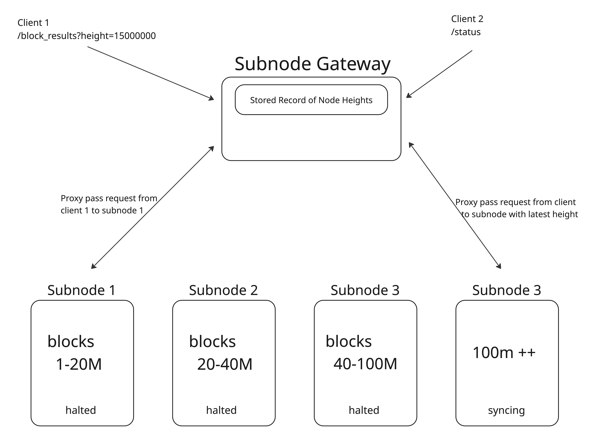

이 가이드는 아카이벌 데이터를 제공하는 노드 플릿을 생성하고 게이트웨이를 사용하여 연결하는 과정을 안내합니다.

## 아키텍처

아카이벌 데이터 제공을 더 접근하기 쉽게 하기 위해 데이터를 더 작은 세그먼트로 분할합니다. 이러한 세그먼트는 `s3://injective-snapshots/mainnet/subnode`에 저장됩니다.

| Snapshot Dir | 높이 범위 | Injective 버전 | 권장 디스크 크기 |
| ------------ | ------------ | ----------------- | --------------------- |
| `/0073`      | 0 – 73M      | v1.12.1           | 42 TiB                |
| `/6068`      | 60M – 68M    | v1.12.1           | 7 TiB                 |
| `/7380`      | 73M – 80M    | v1.12.1           | 7 TiB                 |
| `/8088`      | 80M – 88M    | v1.13.3           | 7 TiB                 |
| `/8896`      | 88M – 96M    | v1.13.3           | 7 TiB                 |
| `/8898`      | 88M – 98M    | v1.13.3           | 7 TiB                 |
| `/98106`     | 98M – 106M   | v1.13.3           | 7 TiB                 |
| `/98107`     | 98M – 107M   | v1.14.0           | 7.5 TiB               |
| `/66101`     | 66M – 101M   | v1.14.0           | 27 TiB                |
| `/105116`    | 105M – 116M  | v1.15.0           | 7.5 TiB               |
| `/113127`    | 113M – 127M  | v1.15.0           | 11 TiB                |
| `/119143`    | 119M – 143M  | v1.17.0           | 16 TiB                |
| `/138150`    | 138M – 150M  | v1.17.2           | 5.8 TiB               |

이러한 세그먼트는 블록 범위에 따라 쿼리를 적절한 노드로 라우팅하는 애그리게이터 프록시인 게이트웨이를 통해 연결됩니다.



## 시스템 요구 사항

| 구성 요소   | 최소 사양 | 참고                                                      |
| ----------- | --------------------- | ---------------------------------------------------------- |
| **CPU**     | AMD EPYC™ 9454P       | 48 코어 / 96 스레드                                     |
| **메모리**  | 128 GB DDR5 ECC       | DDR5-5200 MHz 이상, 데이터 무결성을 위한 ECC            |
| **스토리지** | 7 – 40 TB NVMe Gen 4  | PCIe 4.0 드라이브, 단일 드라이브 또는 RAID-0 어레이 가능 |

## 설정 단계
### 아카이벌 세그먼트를 호스팅하는 각 노드에서:
#### 1. 아카이벌 세그먼트 다운로드:
```bash
aws s3 cp --recursive s3://injective-snapshots/mainnet/subnode/<SNAPSHOT_DIR> $INJ_HOME
```

#### 2. 적절한 injective 바이너리 다운로드

#### 3. config 폴더 생성:
```bash
injectived init $MONIKER --chain-id injective-1 --home $INJ_HOME --overwrite
```

#### 4. 프루닝 비활성화 및 p2p 차단:
```bash
sed -i 's/^pruning *= *.*/pruning = "nothing"/' $INJ_HOME/config/app.toml
sed -i 's/^log_level *= *.*/log_level = "error"/' $INJ_HOME/config/app.toml
```

#### 5. 노드 실행:
```bash
injectived start --home $INJ_HOME
```

### 게이트웨이 구성

```bash
git clone https://github.com/decentrio/gateway
make build
```

구성 파일 예시:
```yaml
upstream:
  - rpc: "http://$NODE1:$RPC_PORT"
    grpc: "$NODE1:$GRPC_PORT"
    api: "http://$NODE1:$API_PORT"
    blocks: [0,80000000]

ports:
  rpc: $RPC_PORT
  api: $API_PORT 
  grpc: $GRPC_PORT
  jsonrpc: 0
  jsonrpc_ws: 0
```

```bash
gateway start --config $CONFIG_FILE
```
