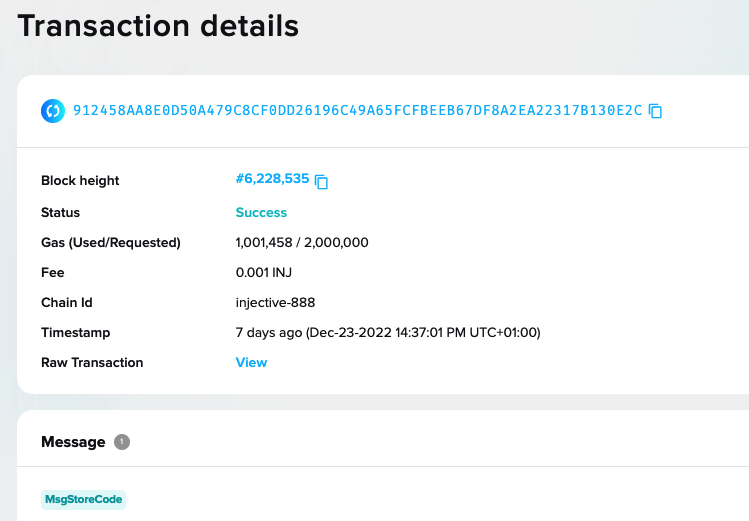

# Your first Injective smart contract

This app example is created to illustrate the structure of an application with smart contracts and a basic front end to interact with it. 

The open-source application code, including the smart contract code, can be found in this [github repository](https://github.com/InjectiveLabs/cw-counter).

The counter website allows you to interact with an instance of the smart contract on the Injective Testnet.

# Prerequisites

Before starting, make sure you have [rustup](https://rustup.rs/) along with a
recent `rustc` and `cargo` version installed. Currently, we are testing on 1.58.1+.

And you need to have the `wasm32-unknown-unknown` target installed as well.

You can check that via:

```sh
rustc --version
cargo --version
rustup target list --installed
# if wasm32 is not listed above, run this
rustup target add wasm32-unknown-unknown
```

# Objective

Create and interact with a smart contract that increases and resets a counter to a given value. 

You will understand the basics of cosmwasm smart contract, learn how to deploy it on Injective, interact with it using [Injective tools](../../tools/index.mdx), and create a simple front end using [`InjectiveTS`](../../tools/injectivets/index.md).

# CosmWasm contract basics

You will learn the smart contract basics, and specifically, we will focus on the State, QueryMsg and ExecuteMsg.

In our [sample counter contract](https://github.com/InjectiveLabs/cw-counter/blob/59b9fed82864103eb704a58d20ddb4bf94c69787/src/msg.rs), we have 1 query and 2 different execute methods implemented.

## State

:::info
CosmWasm [State documentation](https://docs.cosmwasm.com/dev-academy/develop-smart-contract/intro#contract-state) 
:::

`State` handles the state of the database where smart contract data is stored and accessed.

For our counter contract we got:

`count` Is a 32-bit integer which the execute messages will interact with by increasing or reseting it.
`owner` Is the sender `address` of the `MsgInstantiateContract`, and will determine if some execution messages are permited.  

```c title="https://github.com/InjectiveLabs/cw-counter/blob/master/src/state.rs"
pub struct State {
    pub count: i32, 
    pub owner: Addr,
}
```

## QueryMsg

:::info
CosmWasm [QueryMsg documentation](https://docs.cosmwasm.com/tutorials/simple-option/develop/#querymsg) 
:::

The `GetCount` [query message](https://github.com/InjectiveLabs/cw-counter/blob/59b9fed82864103eb704a58d20ddb4bf94c69787/src/msg.rs#L16) has no parameters and returns the `count` value. 

Check the implementation details at [`contract.rs`](https://github.com/InjectiveLabs/cw-counter/blob/59b9fed82864103eb704a58d20ddb4bf94c69787/src/contract.rs#L72)

## ExecuteMsg

:::info
CosmWasm [ExecuteMsg documentation](https://docs.cosmwasm.com/tutorials/simple-option/develop/#handle) 
:::

We have [two ExectueMsg](https://github.com/InjectiveLabs/cw-counter/blob/59b9fed82864103eb704a58d20ddb4bf94c69787/src/msg.rs#L9), `Increment` and `Reset`, find out the [Implementation details](https://github.com/InjectiveLabs/cw-counter/blob/59b9fed82864103eb704a58d20ddb4bf94c69787/src/contract.rs#L47)

`Increment` has no input parameter and, increases the value of count by 1.
`Reset` gets an i32 as a parameter and resets the value of `count` to the input parameter. 

## Unit test

Run the unit test, that should be the first line of assurance before moving forward into deploying the code into the chain. They are quick to execute and give nice output on failures, especially
if you do `RUST_BACKTRACE=1`.

```c
cargo unit-test // run it with RUST_BACKTRACE=1 for helpful backtraces
```

You can find the [unit test implementation](https://github.com/InjectiveLabs/cw-counter/blob/59b9fed82864103eb704a58d20ddb4bf94c69787/src/contract.rs#L88) at `src/contract.rs` 

# Building the Contract

Now that we understand the contract we can go ahead and prepare the code for uploading it to the chain.

:::info
Read more details on [preparing the Wasm bytecode for production](https://github.com/InjectiveLabs/cw-counter/blob/59b9fed82864103eb704a58d20ddb4bf94c69787/Developing.md#preparing-the-wasm-bytecode-for-production) 
:::

CosmWasm have produced [rust-optimizer](https://github.com/CosmWasm/rust-optimizer), a docker image to produce an extremely small build output consistently. The suggested way to run it is this:

```bash
docker run --rm -v "$(pwd)":/code \
  --mount type=volume,source="$(basename "$(pwd)")_cache",target=/code/target \
  --mount type=volume,source=registry_cache,target=/usr/local/cargo/registry \
  cosmwasm/rust-optimizer:0.12.9
```

Or, If you're on an arm64 machine, you should use a docker image built with arm64.
```bash
docker run --rm -v "$(pwd)":/code \
  --mount type=volume,source="$(basename "$(pwd)")_cache",target=/code/target \
  --mount type=volume,source=registry_cache,target=/usr/local/cargo/registry \
  cosmwasm/rust-optimizer-arm64:0.12.9
```

We must mount the contract code to `/code`. You can use a absolute path instead
of `$(pwd)` if you don't want to `cd` to the directory first.

This produces an `artifacts` directory with a `PROJECT_NAME.wasm`, as well as
`checksums.txt`, containing the Sha256 hash of the wasm file.
The wasm file is compiled deterministically (anyone else running the same
docker on the same git commit should get the identical file with the same Sha256 hash).

## Download dockerised Injective Chain binary
In this section, you will choose a set up for your `injectived`, create an account programmatically and send funds to it. 

:::info
[`injectived`](../../tools/injectived/02_using.md) is the command-line interface and daemon that connects to Injective and enables you to interact with the Injective blockchain.
:::

We prepared a Docker image of the Injective chain for making this tutorial easier. Alternatively, you can follow the [install instructions](../../tools/injectived/01_install#option-1-from-binary) for `injectived` and run it locally.

:::tip
If you install `injectived` from the binary, ignore the docker commands.
On the [public endpoints section](https://docs.injective.network/develop/public-endpoints) you can find the right --node info to interact with Mainnet & testnet.
:::

Executing this command will make the docker container execute indefinitely.

```bash
docker run --name="injective-core-staging" \
-v=<directory_to_which_you_cloned_cw-plus>/artifacts:/var/artifacts \
--entrypoint=sh public.ecr.aws/l9h3g6c6/injective-core:staging \
-c "tail -F anything"
```
Note: ` -v=<directory_to_which_you_cloned_cw-counter> ` must be an absolute path, and it is easy to find running `pwd` inside the CosmWasm/cw-counter repo. 

Open a new terminal and get in the Docker container to initialize the chain.

```bash
docker exec -it injective-core-staging sh
```

Let’s start by adding ```jq``` dependency, which will be needed later on:

```bash
# inside the "injective-core-staging" container
apk add jq
```

Now we can proceed to local chain initialization and add a test user (when prompted use 12345678 as password). We will use it only to generate a new private key that later on will be used for signing messages on the testnet.

```sh
# inside the "injective-core-staging" container
injectived keys add testuser
```

**OUTPUT**
```
- name: testuser
  type: local
  address: inj1exjcp8pkvzqzsnwkzte87fmzhfftr99kd36jat
  pubkey: '{"@type":"/injective.crypto.v1beta1.ethsecp256k1.PubKey","key":"Aqi010PsKkFe9KwA45ajvrr53vfPy+5vgc3aHWWGdW6X"}'
  mnemonic: ""

**Important** write this mnemonic phrase in a safe place.
It is the only way to recover your account if you ever forget your password.

wash wise evil buffalo fiction quantum planet dial grape slam title salt dry and some more words that should be here
```

Take a moment to write down the address, you will need it,  or export it as an env variable.

```bash
# inside the "injective-core-staging" container
export INJ_ADDRESS= <your inj address>
```
:::info
Add some test tokens to your recently generated test address with the [Injective test faucet](https://faucet.injective.network/).
:::

Now you have successfully created testuser on Injective testnet. The testuser should have `10000000000000000000` INJ balance. 

Search for your address in the testnet [Injective explorer](https://testnet.explorer.injective.network/) to check your balance. 

Alternatively, you can verify it by querying the bank balance - [https://k8s.testnet.lcd.injective.network/swagger/#/Query/AllBalances](https://k8s.testnet.lcd.injective.network/swagger/#/Query/AllBalances)  or with curl:

```bash
curl -X GET "https://k8s.testnet.lcd.injective.network/cosmos/bank/v1beta1/balances/<your_INJ_address>" -H "accept: application/json"
```

## Upload the wasm contract

In this section, we will upload the .wasm file, you compile in the previous steps, to Injective Testnet. 

```bash
# inside the "injective-core-staging" container
yes 12345678 | injectived tx wasm store artifacts/cw-counter.wasm \
--from=$(echo $INJ_ADDRESS) \
--chain-id="injective-888" \
--yes --fees=1000000000000000inj --gas=2000000 \
--node=https://k8s.testnet.tm.injective.network:443
```

**Output:**
```bash
code: 0
codespace: ""
data: ""
events: []
gas_used: "0"
gas_wanted: "0"
height: "0"
info: ""
logs: []
raw_log: '[]'
timestamp: ""
tx: null
txhash: 912458AA8E0D50A479C8CF0DD26196C49A65FCFBEEB67DF8A2EA22317B130E2C
```

Check your address on the [Injective testnet explorer](https://testnet.explorer.injective.network), and look for a transaction with the `txhash` you got as a result of storying the code, it will be a `MsgStoreCode` type of transaction. 



You can see [all stored codes on Injecteve testnet](https://testnet.explorer.injective.network/codes/).

:::tip
There are different ways to find the one that you just stored:

* Look for the TxHash you obtained at the Injective Explorer [codes list](https://testnet.explorer.injective.network/codes/), probably it is the last one.
* Use `injectived` to see all the outcomes of storing the code
:::

To query the transaction use the `txhash` and verify the contract was deployed. 

```sh
injectived query tx 912458AA8E0D50A479C8CF0DD26196C49A65FCFBEEB67DF8A2EA22317B130E2C --node=https://k8s.testnet.tm.injective.network:443
```

Inspecting the output more closely, we can see the code_id of `290` for the contract

```bash
- events:
  - attributes:
    - key: access_config
      value: '{"permission":"Everybody","address":""}'
    - key: checksum
      value: '"+OdoniOsDJ1T9EqP2YxobCCwFAqNdtYA4sVGv7undY0="'
    - key: code_id
      value: '"290"'
    - key: creator
      value: '"inj1h3gepa4tszh66ee67he53jzmprsqc2l9npq3ty"'
    type: cosmwasm.wasm.v1.EventCodeStored
  - attributes:
    - key: action
      value: /cosmwasm.wasm.v1.MsgStoreCode
    - key: module
      value: wasm
    - key: sender
      value: inj1h3gepa4tszh66ee67he53jzmprsqc2l9npq3ty
    type: message
  - attributes:
    - key: code_id
      value: "290"
    type: store_code
```

Let's export your code id as ENV variable. You can skip this step and manually add it to the next step. 

```bash
export CODE_ID= <code_id of your stored contract>
```

## Generating JSON Schema

While the Wasm calls (`instantiate`, `execute`, `query`) accept JSON, this is not enough
information to use it. We need to expose the schema for the expected messages to the
clients. You can generate this schema by calling `cargo schema`, which will output
4 files in `./schema`, corresponding to the 3 message types the contract accepts,
as well as the internal `State`.

These files are in standard json-schema format, which should be usable by various
client side tools, either to auto-generate codecs, or just to validate incoming
json wrt. the defined schema.

Take a minute to generate the schema, you can also [take a look at it here](https://github.com/InjectiveLabs/cw-counter/blob/master/schema/cw-counter.json). Get familiar with it, as you will need to it for the next steps. 

## Instantiate the contract

Now that we have the code on chain it is time to instantiate this code and have an actual contract.

:::note
On CosmWasm, the upload of a contract's code and the instantiation of a contract are regarded as separate events.
:::

To call this function to instantiate the contract, run the CLI command with the code_id you got in the previous step, along with the [JSON encoded initialization arguments](https://github.com/InjectiveLabs/cw-counter/blob/ea3b781447a87f052e4b8308d5c73a30481ed61f/schema/cw-counter.json#L7) and a label (a human-readable name for this contract in lists). 

```bash
INIT='{"count":"99"}'
yes 12345678 | injectived tx wasm instantiate $CODE_ID $INIT \ 
--label="CounterTestInstance" \
--from=$(echo $INJ_ADDRESS) \
--chain-id="injective-888" \ 
--yes --fees=1000000000000000inj \
--gas=2000000 \
--no-admin \
--node=https://k8s.testnet.tm.injective.network:443
```
**Output:**
```bash
code: 0
codespace: ""
data: ""
events: []
gas_used: "0"
gas_wanted: "0"
height: "0"
info: ""
logs: []
raw_log: '[]'
timestamp: ""
tx: null
txhash: 01804F525FE336A5502E3C84C7AE00269C7E0B3DC9AA1AB0DDE3BA62CF93BE1D
```

:::info
You can find the contract address and metadata on 
- The [testnet explorer](https://testnet.explorer.injective.network/contracts/) 
- Querying the API [contract code](https://k8s.testnet.lcd.injective.network/swagger/#/Query/ContractsByCode) and [code info](https://k8s.testnet.lcd.injective.network/swagger/#/Query/ContractInfo) 
- or by CLI query 
:::

```bash
injectived query wasm contract inj1ady3s7whq30l4fx8sj3x6muv5mx4dfdlcpv8n7 --node=https://k8s.testnet.tm.injective.network:443
```

## Querying the contract

As we know, from the [previous section](Your_fist_contract_on_injective#querymsg), the only QueryMsg we have is `get_count`

```bash
GET_COUNT_QUERY='{"get_count":{}}'
injectived query wasm contract-state smart inj1ady3s7whq30l4fx8sj3x6muv5mx4dfdlcpv8n7 "$GET_COUNT_QUERY" \
--node=https://k8s.testnet.tm.injective.network:443 \
--output json
```

**Output:**    
```bash
{"data":{"count":99}}
```

We see that `count` is set to 99, as we defined when we [instantiate the contract](Your_fist_contract_on_injective#instantiate-the-contract). 

## Execute the contract

Let's now interact with the contract by increasing the counter.

```bash
INCREMENT='{"increment":{}}'
yes 12345678 | injectived tx wasm execute inj1ady3s7whq30l4fx8sj3x6muv5mx4dfdlcpv8n7 "$INCREMENT" --from=$(echo $INJ_ADDRESS) \
--chain-id="injective-888" \
--yes --fees=1000000000000000inj --gas=2000000 \
--node=https://k8s.testnet.tm.injective.network:443 \
--output json
```

**Output:**    
```bash
{"data":{"count":100}}
```

:::note
- <strong>yes 12345678</strong> ➡️ Introduces the passphrase so you do not need to do it.
- <strong>from=testuser</strong> ➡️ Your key is the admin of the contract and the only one that can execute it 
:::

And this is how we reset the counter

```bash
RESET='{"reset":{"count":999}}'
yes 12345678 | injectived tx wasm execute inj1ady3s7whq30l4fx8sj3x6muv5mx4dfdlcpv8n7 "$RESET" \
--from=$(echo $INJ_ADDRESS) \
--chain-id="injective-888" \
--yes --fees=1000000000000000inj --gas=2000000 \
--node=https://k8s.testnet.tm.injective.network:443 \
--output json
```
